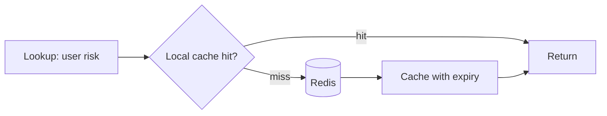
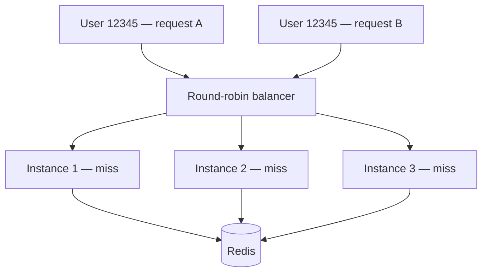
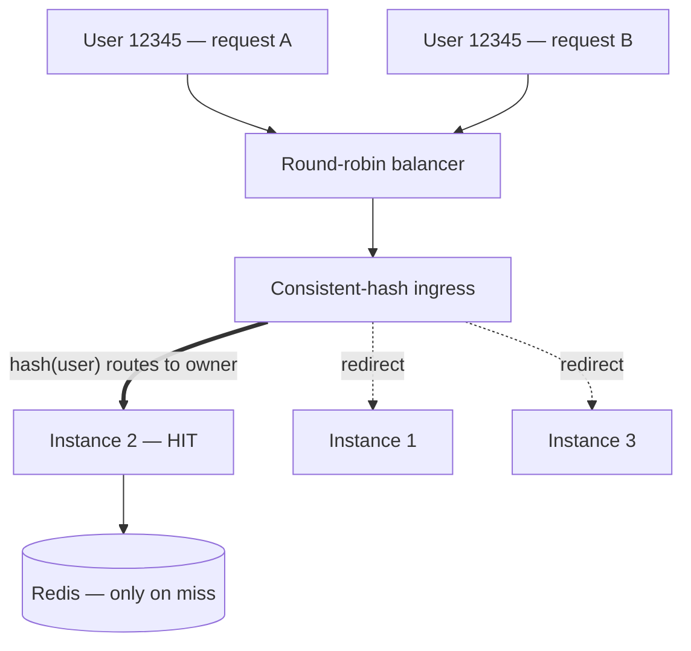

> A quick note: this is a true story from my internship on a trust-and-safety team at TikTok. I've kept the people and the internal systems vague on purpose — the engineering lesson is general enough to stand on its own, and the personal one is mine to tell.

## The dinner

I'd already passed the interviews. The coding screen and the technical-and-experience conversation with the team lead were done, so I was a little surprised when my would-be manager asked to take me to dinner. For context, the two of us were actually pretty close — that relationship went back to an earlier internship I'd done at TikTok — so I figured the dinner would be relaxed, basically him telling me I'd got the job and walking me through what I'd be working on. I went in completely calm.

Midway through, his tone shifted and he started asking me about a problem he was dealing with at work. It was obvious he'd already solved it, which is what made it strange: he kept holding certain details back and asking how *I* would approach it. *Why does this feel like I'm being interviewed?*

Turns out I was, and for a good reason. On my earlier TikTok internship I'd left behind a manager who thought I was unreliable, and that feedback had travelled — up to the leadership of the team I was about to join, then back down to the person who actually wanted to hire me. It had planted enough doubt that he wanted to see for himself. So over dinner he walked me through a gnarly bug and asked how I'd design a system that took some metadata and routed an alert to the right procedure. I answered as best I could. (With hindsight — and a few years of watching what small language models can now do — I think the system we were talking about was wildly over-engineered, but that's a different post.) Whatever I said was good enough, and I got the internship. I just started it carrying a word I hadn't chosen.

I want to tell you what I built that summer, but the build only really means anything next to that word, so I'm going to tell you both at the same time.

## On being called "unreliable"

I should explain how I think about this kind of thing, because it's more or less my whole approach to work. The only part I can actually control is whether I did my best — everything after that, how it gets read, what people decide it means, which labels end up stuck to me, is mostly out of my hands. So I didn't really believe the "unreliable" thing. Not because I think I'm some prodigy; I just knew what I was capable of, and I'd decided a long time ago that the only scorecard that counts is my own. If I go home knowing I did my best, that's the win.

That said, I won't pretend the label did nothing. It didn't make me feel bad so much as it made me genuinely want to prove that the person who'd vouched for me had been right to. Not to prove anyone wrong — to prove *him* right. I know those sound like the same thing, but they really aren't: one runs on resentment and slowly makes you bitter, and the other runs on gratitude and will happily carry you through a long run of late nights. Which, as it happened, is exactly what I was in for.

## A cache that wouldn't cache

The actual work was easy enough to describe. For any given user, our service had to look up their "risk" — a set of safety-related scores — and those scores lived in Redis, topped up by a background job. Every meaningful action triggered one of these lookups, and at peak we were doing something like 3.5 million of them a second. Redis was not having a good time: CPU creeping up, the whole thing getting fragile, alarms going off. The standard fix here is about as old as caching itself — put a small cache inside each instance, in front of Redis, so most lookups never have to travel all the way there. Check local first; if it's not there, go to Redis and remember the answer for next time.

I got a bit too excited about the cache itself. I figured our traffic was roughly Zipfian — a handful of users getting looked up constantly, a long tail of users barely at all — which is exactly the situation a good cache is built for. So I reached for [Ristretto](https://github.com/dgraph-io/ristretto), which is genuinely clever about what it chooses to keep: a Count-Min Sketch for admission, TinyLFU for eviction, the works. (The [dgraph write-up on its design](https://discuss.dgraph.io/t/introducing-ristretto-a-high-performance-go-cache-dgraph-blog/5102) is worth a read if you find this stuff fun.) I wired it up, shipped it, and the hit ratio came back at about one percent — which is somehow worse than doing nothing, because the caches were thrashing hard enough to balloon our memory under GC pressure while giving us basically no benefit in return. I'd poured all my effort into the most interesting part of the problem, and it turned out not to matter even slightly.

## The lesson hiding in the failure

It took me embarrassingly long to figure out why. The load balancer in front of us was round-robin, so any given user's requests got sprinkled evenly across every instance. No single instance ever saw the same user often enough for caching them to pay off — every instance was busy caching everyone and hitting no one.

The lesson has stuck with me, and I keep bumping into bigger versions of it: the cache was never the thing that mattered — locality was. My clever eviction policy was a great answer to a question nobody had asked. What we actually needed was for the same user to keep landing on the same instance. Get that right and even a dumb cache works fine; get it wrong and the smartest cache in the world hits one percent.

## The fix, and a teammate

The clean fix would have been to get the upstream team to route traffic to us by user, but that was their roadmap and their priorities, not ours, and my internship clock was ticking — realistically it wasn't going to land in time. So we went with the scrappier option and solved it on our own side: an ingress layer that grabbed each request, hashed the user onto a consistent-hash ring of our live instances, and forwarded it to whichever instance "owned" that user — with a fallback to just serving it locally if the redirect failed, plus some caps so we wouldn't accidentally cook a single instance. We'd basically turned our own fleet into a sharded cache, partitioned by user.

That took the hit ratio from around 1% to about 52%, and Redis CPU from 26% down to 14%. It wasn't free — the redirect added roughly 3ms per call — but trading a few milliseconds for halving the load on a struggling database is an easy call, and honestly that trade-off was the real engineering, much more than any of the cache cleverness.

Here's the part I really want to be straight about, though: I didn't build that ingress layer. A senior engineer on the team did — someone I ended up becoming good friends with. I built the cache half: the local cache, the per-key expiry logic, the traffic controls that let us roll it out a few percent at a time, the safety bits. He built the routing. And neither half was worth anything without the other. I was on a team where individual impact was measured and rewarded pretty heavily, and the best thing I did there was something I couldn't have done on my own. I don't really buy the lone-genius version of engineering anymore — the genuinely hard stuff I've watched get solved usually gets solved by two people who trust each other talking it out until there's one answer.

## The part that kept me up at night

The thing that actually kept me up was staleness. A cache can serve old data, and in a safety system "old data" can quietly mean "let something through that you should have caught." So we couldn't just pick a cache size and move on — we had to sit down as a team and go score by score: how stale is too stale for this one? An expiry that's completely fine for one signal is reckless for another.

What let me sleep was dry-run mode: serve from the cache like normal, but still fetch the real value from Redis and compare the two, so we could measure exactly how often we *would have* served something stale without ever actually doing it. On real traffic, even at 3.5 million requests a second, the number came back reassuringly small — we'd more or less gotten the expiry strategy right. The important part is that we knew that, with real evidence, before betting the system on it. Finding a way to be wrong safely before you're wrong expensively is probably the most useful habit I took away from the whole thing.

## The verdict

Towards the end, the most senior engineer in the org told me he was glad he'd signed off on bringing me in. Then he added something that's stayed with me: looking back, he thought a lot of what had gone sideways on my earlier internship was less about me and more about leadership. I'd be lying if I said that wasn't a relief — but it was a complicated one. It's a strange feeling to get quietly re-graded by the same system that graded you the first time. I didn't feel vindicated, exactly. Mostly I was just glad I'd managed to do right by the one person who'd put himself on the line for me, because that was the thing I'd actually been chasing the whole time.

## Cached aside, for the better

There's a coda, and it's probably the part I learned the most from. I wanted to come back, and the team wanted me back too — my manager and his manager both pushed for it. But the call didn't sit with the people I'd actually worked alongside; it sat with people who hadn't, and for reasons that were more political than anything to do with me, it didn't happen.

That's the symmetry I keep coming back to. Twice now, big decisions about my path got made by people who'd never actually worked with me. The first time I managed to beat it, because I got let into the room and once I was in there I could just do the work. The second time I couldn't, because the work was never really the question — I just never got into the room. That's the honest limit of "just do your best": it clears away doubt when you're given the chance to earn it, and when you're not, it doesn't, and grinding harder won't change that. It used to bug me. It genuinely doesn't anymore. I did right by the people who were actually in the room with me, and I learned more in those few months than in almost any other stretch of my career so far.

The system was called the Cache-Aside Reducer, which in hindsight is almost too on the nose. I spent that internship being, in a way, set aside — and it turned out to be for the better.
