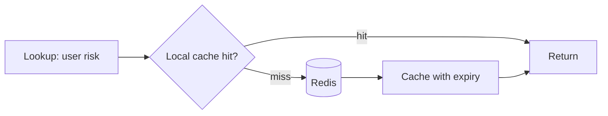
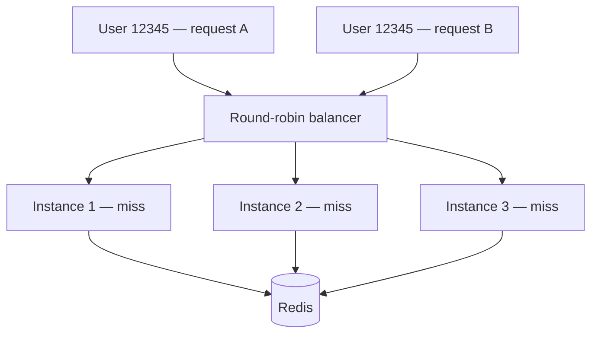
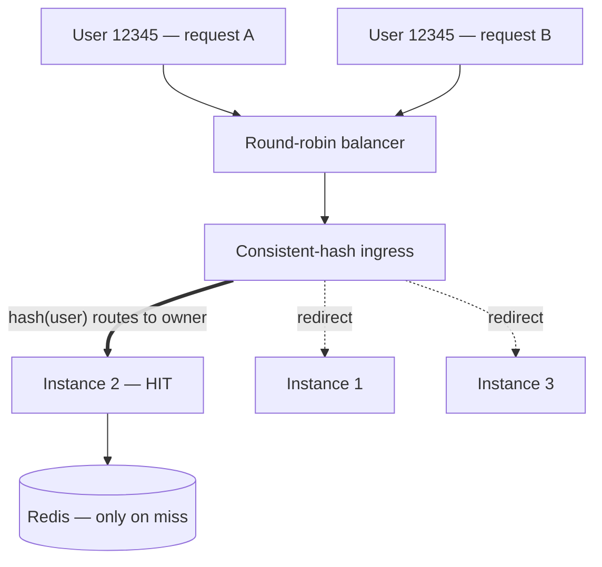

> A note on this one: it's a true story from a trust-and-safety team I interned on, but I've kept the company, people, and internal systems out of it on purpose. The engineering lesson is general, and the human one is mine to tell.

## The dinner

I'd already passed the interviews. The coding screen, the system-design conversation with the team lead — done. By any normal process, I had the job.

So I was surprised when my would-be manager asked to take me to dinner. I was less surprised, and more quietly winded, when halfway through it became clear the dinner *was* another interview.

A label had arrived before I did. On an earlier internship — different team, same company — I'd left behind a manager who thought I was unreliable. That word had traveled: up through the org, across to the leadership of the team I was about to join, and back down to the person who actually wanted to hire me. It had put enough doubt in his head that he wanted to see for himself. So over dinner he asked me about a gnarly bug, and about how I'd design a system that took some metadata and routed an alert to the right procedure. I answered as best I could. (With hindsight — and a few years of watching what small language models can now do — I think the system we were discussing was wildly over-engineered. But that's a different post.)

Whatever I said was enough. I got the internship. But I started it carrying a word I hadn't chosen.

I want to tell you what I built that summer. But the build only means something next to the label, so I'm going to tell you both at once.

## A note on the word "unreliable"

Here's the thing I've come to believe, and it's the closest thing I have to a personal philosophy: you can only really control whether you did your best. Everything after that — how it's read, who it reaches, what label it earns you — is weather.

So I never actually believed the word. Not out of arrogance; I just knew what I was capable of, and I'd decided long ago that my standard would be internal. If I went home content that I'd done the best I could, that was the win. The rest was noise.

But I'd be lying if I said the word didn't *do* anything. It made me want — badly — to prove that the person who'd vouched for me had been right to. Not to prove anyone wrong. To prove *him* right. Those sound similar and they are completely different fuels. One is powered by resentment and it burns dirty. The other is powered by gratitude, and it'll get you through a lot of late nights.

I was about to need a lot of late nights.

## The problem: a cache that wouldn't cache

The system was conceptually simple. For any given user, a service needed to look up their "risk" — a set of safety-related scores. Those scores lived in Redis, refreshed by a background job. Every relevant action meant a lookup, and at peak we were doing about **3.5 million lookups per second**.

Redis was buckling. CPU climbing, fragility increasing, alarms going off. The obvious fix is the oldest trick in the book: put a small cache *in front* of Redis, inside each service instance, so most lookups never travel to Redis at all. Cache-aside — check local first; on a miss, go to Redis and remember the answer.

I went deep on the cache itself. I had a theory that our access pattern was roughly Zipfian — a few users looked up constantly, a long tail rarely — which is exactly where a smart cache shines. So I reached for a good one: [Ristretto](https://github.com/dgraph-io/ristretto), a high-performance Go cache that uses admission control with a Count-Min Sketch and TinyLFU eviction to be clever about *what it keeps*. (Dgraph's [write-up on the design](https://discuss.dgraph.io/t/introducing-ristretto-a-high-performance-go-cache-dgraph-blog/5102) is a genuinely great read if you like this sort of thing.)

I shipped it. And the hit ratio was about **one percent.**

One percent. Worse than useless — the caches churned so hard that memory ballooned under garbage-collection pressure while delivering essentially no benefit. I had optimized the most interesting variable, and it hadn't mattered at all.

## The lesson hiding in the failure

It took me longer than I'd like to admit to see why. The load balancer in front of our instances was round-robin. So the *same* user's lookups were sprayed evenly across *every* instance. No single instance saw a given user often enough for its cache to ever pay off. Every instance was caching everything, and hitting nothing.

The lesson — and it's one I keep relearning in bigger and bigger ways — is this:

> The cache implementation was never the point. **Locality** was. The clever eviction policy was a beautiful answer to a question nobody was asking.

What we actually needed was for the same user to keep landing on the same instance. Get *that* right and even a dumb cache works. Get it wrong, and the world's smartest cache hits one percent.

## The fix: routing, and a teammate

The textbook fix would have been to ask the upstream team to route traffic to us by user. But that was their roadmap, their incentives, and my internship clock was short. It was never going to happen in time.

So we did the unconventional thing: we solved it on *our* side, with an ingress layer that intercepted each request, hashed the user onto a **consistent-hash ring** of our live instances, and forwarded the request to whichever instance "owned" that user — falling back to serving it locally if a redirect failed, with caps so no single instance got overloaded. We'd essentially turned our own fleet into a sharded, distributed cache, partitioned by user.

The hit ratio went from ~1% to about **52%.** Redis CPU dropped from **26% to 14%.** The cost, stated honestly, was roughly **3 milliseconds** of added latency per call for the redirect hop — and weighing a few milliseconds against halving a database's load *is* the actual engineering. Not the cache. The decision.

And here is the part I most want to be honest about: **I didn't build that ingress layer.** A senior engineer on the team did — someone who became a friend. I built the cache side: the local cache, the per-key expiry logic, the traffic controls that let us roll out a careful percentage at a time, the safety mechanisms. He built the routing. Neither half worked without the other.

I was on a team where individual performance was measured and rewarded heavily. And the best thing I did there, by a distance, was something neither of us could have done alone. I've stopped believing the lone-genius story of engineering. The hardest problems I've watched get solved get solved by two people who trust each other arguing toward one answer. The team's solution beats the individual's, every time.

## The part that kept me up at night (literally)

Caching safety scores is a little frightening, because a cache can serve *stale* data — and stale, in a safety system, can mean letting through something you should have caught. So we couldn't just pick a cache size and walk away. We had to sit down, as a team, and decide for each kind of score: what is the maximum staleness we can live with? An expiry that's safe for one signal is reckless for another.

What let me sleep was a **dry-run mode**: serve from the cache *as if* in production, but still fetch the real value from Redis and compare the two. It told us, on real traffic, exactly how often we *would have* served something stale — without ever actually risking it. The answer turned out to be reassuringly tiny, even at 3.5 million requests a second. We'd gotten the expiry strategy about right. But we *knew* that, with evidence, before we ever bet the system on it.

That habit — find a way to be wrong safely, before you're wrong expensively — might be the most useful thing I took from the whole project.

## The verdict

Near the end, the most senior engineer in the org told me he was glad he'd approved bringing me on. And then he said something I've thought about a lot since: that looking back, much of what had gone wrong on my earlier internship was less about me and more about leadership.

I won't pretend that wasn't a relief. But it was a complicated one. It's a strange thing to be quietly re-classified by the same system that classified you in the first place — to have a word taken back. I didn't feel triumphant. Mostly I felt grateful that I'd managed to do right by the one person who'd stuck his neck out for me. That was the win I'd actually been chasing. The rest was just the weather clearing.

## Cached aside, for the better

There's a coda, and it's the part that taught me the most.

I wanted to come back. The team wanted me back; my manager and his manager fought for it. But the decision didn't rest with the people I'd worked with — it rested with people who *hadn't*, and for reasons more political than personal, it didn't happen.

And there's the symmetry I can't unsee. Twice, my path was decided by people who had never actually worked with me. The first time, I beat it — because I was let into the room, and once I was in the room I could just do the work. The second time, I couldn't — because the work was never the question; I was never let into the room at all.

That's the honest limit of "just do your best": it dissolves doubt *when you're given the chance to earn it.* When you're not, it doesn't, and no amount of effort changes that. For a while that bothered me. It doesn't anymore. I did the best I could by the people in the room with me, and I learned more in those months than in almost any other stretch of my career.

The system was named, almost too perfectly, the Cache-Aside Reducer. I spent that internship being, in a sense, set aside. It turned out to be for the better.
