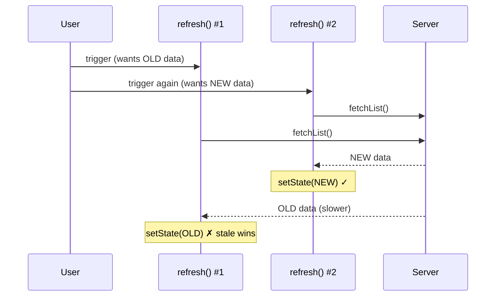

> Sample entry — swap in a real debugging story of your own.

The bug report was the worst kind: "sometimes the list shows stale data." Sometimes. Not always. Of course it never reproduced on my machine.

## Chasing a ghost

My first mistake was assuming the report was vague because the user was vague. Actually, *the report was precise* — it really did only happen sometimes, because it was a race condition. Two async calls resolved in an order I'd assumed was fixed but wasn't.

Here's the shape of what I had:

```ts
async function refresh() {
  const data = await fetchList();   // slow request
  setState(data);                   // ...what if a newer refresh() already finished?
}
```

If a user triggered `refresh()` twice quickly, an older, slower response could land *after* a newer one and overwrite it:



The fix was to track the latest request and ignore stale responses:

```ts
let latest = 0;
async function refresh() {
  const token = ++latest;
  const data = await fetchList();
  if (token === latest) setState(data);   // only the newest wins
}
```

## What I actually learned

The code lesson is real, but the meta-lesson mattered more: **"it works on my machine" is not evidence the code is correct — it's evidence my machine didn't hit the race.** Intermittent bugs are almost always a timing or ordering assumption I didn't know I was making.

Now when something "only happens sometimes," my first question is: *what order am I assuming, and what happens if it's different?*
