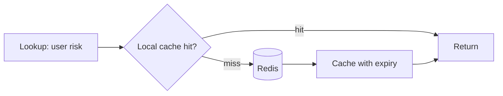
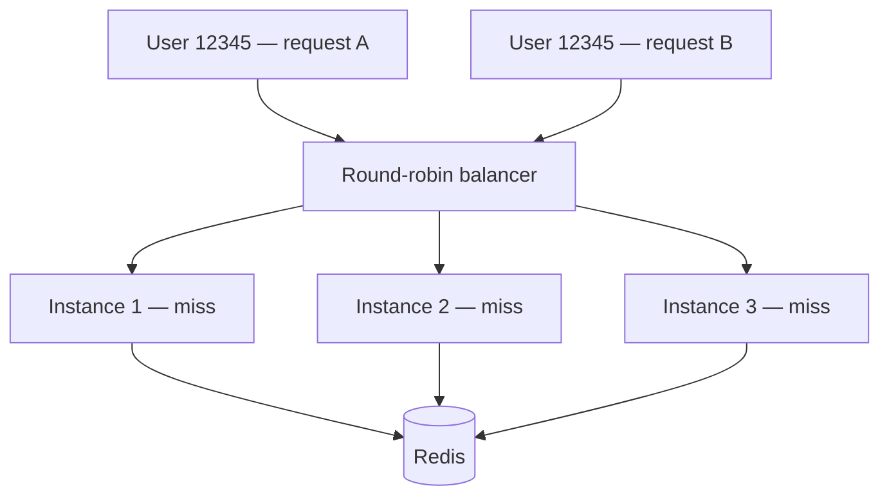
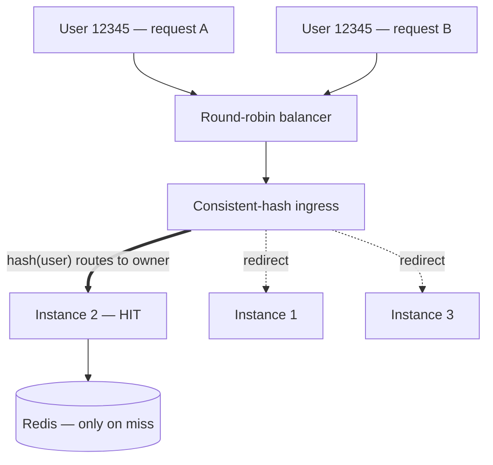

> A quick note: this is a true story from an internship I did. I have kept the company, the people, and the internal systems vague on purpose — the engineering lesson is general enough to stand on its own, and the personal one is mine to tell.

## A non-standard interview

The way I ended up on this team was not a standard interview process, and to explain it I have to start with a dinner.

I had already passed the interviews — the coding screen, and the technical-and-experience conversation with the team lead — so I was a little surprised when my would-be manager asked to take me to dinner. For context, the two of us were already close; that relationship went back to an earlier internship I had done at the same company, and he was the person who had pushed to bring me onto the team. So I assumed the dinner would be relaxed: him confirming I had got the job and walking me through what I would be working on. I went in completely at ease.

Midway through, his tone shifted and he began asking me about a problem he was dealing with at work. It was clear he had already solved it, which is what made it strange — he kept holding certain details back and asking how *I* would approach it. *Why does this feel like I am being interviewed?*

It was because I was, and for a reasonable enough cause. On that earlier internship I had left behind a manager who thought I was unreliable, and that feedback had travelled — up to the leadership of the team I was about to join, then back down to the person who actually wanted to hire me. It had planted enough doubt that he wanted to see for himself. So over dinner he walked me through a gnarly bug and asked how I would design a system that took some metadata and routed an alert to the right procedure. I answered as best I could. (With hindsight — and a few years of watching what small language models can now do — I suspect the system we were discussing was badly over-engineered, but that is a different post.) Whatever I said was good enough, and I got the internship. I just started it carrying a word I had not chosen.

I want to tell you about what I built that summer — but just as much about what it built in me. The two turned out to be hard to separate, so I will tell them together.

## On being called "unreliable"

I should explain how I think about this kind of thing, because it is more or less my whole approach to work. The only part I can actually control is whether I did my best — everything after that, how it gets read, what people decide it means, which labels end up stuck to me, is mostly out of my hands. So I never believed I was "unreliable"; I was young, inexperienced, and hungry to learn, and I am still the same to this day. However, I had decided a long time ago that the only scorecard that counts is my own. If I go home knowing I did my best, that is the win.

None of that means I dismiss feedback — quite the opposite. I try to stay genuinely open to it, wherever it happens to fall on the spectrum from praise to criticism, because the most useful feedback is seldom the most comfortable, and I am always eager to learn and improve. But the standard I hold myself to is simpler than anyone else's assessment: I want to walk away from any situation knowing I did everything I could to be the best version of myself I was capable of being. If I leave something on the table, that one is on me.

That said, I will not pretend the label did nothing. It did not make me feel bad so much as it gave me something to aim at: I wanted to prove that the person who had vouched for me had made the right call. Not to prove anyone wrong — to prove *him* right. Those sound like the same thing, but they are not. One runs on resentment and slowly turns bitter; the other runs on gratitude, and gratitude can carry you through a long stretch of late nights. As it turned out, a long stretch of late nights was exactly what lay ahead.

## A cache that would not cache

The work itself was simple to describe. For any given user, our service had to look up their "risk" — a set of safety-related scores — and those scores lived in Redis, refreshed periodically by a background job. Every meaningful action triggered one of these lookups, and at peak we were issuing roughly 3.5 million of them per second. Redis was beginning to strain under the volume: CPU climbing, behaviour growing less predictable, alarms firing. The standard remedy is almost as old as caching itself — place a small cache inside each instance, in front of Redis, so that most lookups never need to reach it. Check the local cache first; on a miss, fall through to Redis and remember the result for next time.

My instinct was to obsess over the cache itself. I had noticed the traffic arriving in waves — sharp spikes of queries — and talked myself into reading that as a Zipfian access pattern, where a small number of users account for most of the lookups. In hindsight that was a weak assumption: those spikes were really just peaks in overall traffic, which tells you nothing about whether a few users dominated the lookups. I had conflated a surge in volume *over time* with skew *across keys*, and I am not actually certain the distribution was Zipfian at all. But it was a convenient story, because it justified reaching for a more sophisticated cache. So I chose [Ristretto](https://github.com/dgraph-io/ristretto), which is genuinely clever about what it admits and evicts — a Count-Min Sketch to estimate frequency, TinyLFU for eviction (the [dgraph write-up on its design](https://discuss.dgraph.io/t/introducing-ristretto-a-high-performance-go-cache-dgraph-blog/5102) is an excellent read). Something far simpler, like [FreeCache](https://github.com/coocood/freecache), would very likely have done just as well; Ristretto did edge it out for us in practice, but that may well have come down to factors I had not accounted for or fully understood, rather than anything fundamental.

I wired it up, shipped it, and the hit ratio came back at roughly one percent — which is worse than useless, because the caches churned hard enough to inflate our memory under garbage-collection pressure while delivering almost no benefit in return. I had spent all my effort on the most interesting part of the problem, and it had barely moved the needle.

## The lesson hiding in the failure

It took me longer than I would like to admit to understand why. The load balancer in front of us was round-robin, so any given user's requests were distributed evenly across every instance. No single instance ever saw the same user often enough for caching them to pay off — every instance was busy caching everyone and hitting no one.

The lesson has stuck with me, and I keep bumping into bigger versions of it: the cache was never the thing that mattered — locality was. My clever eviction policy was a great answer to a question nobody had asked. What we actually needed was for the same user to keep landing on the same instance. Get that right and even a dumb cache works fine; get it wrong and the smartest cache in the world hits one percent.

## The fix, and a team

The clean fix would have been to ask the upstream team to route traffic to us by user, but that was not in their roadmap, and my internship clock was short — realistically it would not land in time. So we solved it on our own side instead, building on [Kitex](https://github.com/cloudwego/kitex) — the open-source RPC framework whose middleware supported consistent-hash request routing. An ingress layer intercepted each request, hashed the user onto a [consistent-hash](https://en.wikipedia.org/wiki/Consistent_hashing) ring of our live instances, and forwarded it to whichever instance "owned" that user — falling back to serving the request locally if a redirect failed, with caps in place so that no single instance could be overwhelmed. In effect, we had turned our own fleet into a sharded cache, partitioned by user.

That took the hit ratio from around 1% to about 52%, and Redis CPU from 26% down to 14%. It was not free — the redirect added roughly 3ms per call — but trading a few milliseconds for halving the load on a struggling database is an easy decision, and that trade-off, honestly, was the real engineering, far more than any of the cache cleverness.

This is the part I most want to be honest about: I did not build that ingress layer. A senior engineer on the team did — someone who became a good friend. I built the cache side: the local cache, the per-key expiry logic, the traffic controls that let us roll it out a few percent at a time, and the safety mechanisms around it. He built the routing. Neither half was worth much without the other. I was on a team where individual impact was measured and rewarded heavily, and yet the best thing I contributed there was to a collective effort. I have stopped believing the lone-genius account of engineering. I believe the hardest problems are solved by a team — people who trust one another enough to keep arguing toward a single answer.

## Dealing with potential staleness

What genuinely kept me up was the risk of staleness. A cache can serve old data, and in a safety system "old data" can quietly mean "letting through something you should have caught." So we could not simply pick a cache size and move on — we had to work through it as a team, score by score: how stale is too stale for this one? An expiry that is entirely safe for one signal is reckless for another. We handled it with a TTL manager built around a trie keyed on the prefix of each cache key — longest prefix wins — so that every family of scores could be given its own staleness budget: a short expiry where a signal moved quickly, a longer one where it was safe to hold.

What let me sleep was a dry-run mode: serve from the cache as normal, but still fetch the real value from Redis and compare the two, so that we could measure exactly how often we *would have* served something stale without ever actually doing so. On real traffic, even at 3.5 million requests per second, the number came back reassuringly small — we had judged the expiry strategy about right. The important part is that we knew it, with real evidence, before betting the system on it. Finding a way to be wrong safely before you are wrong expensively is probably the most useful habit I took from the whole project.

## The verdict

Towards the end, the most senior engineer in the org told me he was glad he had signed off on bringing me in. Then he added something that has stayed with me: looking back, he thought a great deal of what had gone wrong on my earlier internship was less about me and more about leadership. I will not pretend that was not a relief — though it was a complicated one. It is a strange feeling to be quietly re-graded by the same system that graded you the first time. I did not feel vindicated, exactly. Mostly I was just glad I had managed to do right by the one person who had put himself on the line for me, because that was what I had been chasing the whole time.

## Cached aside, for the better

There is a coda, and it is probably the part that taught me the most. I wanted to come back, and I was wanted back — the whole team advocated for it, and the leader our tech lead reported to fought hard to make it happen. But for reasons beyond me, I could not return.

It taught me the honest limit of "just do your best": you can give something everything you have and still find the outcome resting somewhere beyond your control. That used to trouble me. It genuinely does not anymore. I did right by the people who were in the room with me, and it felt like years of knowledge and life lessons condensed into a few short months.

If there is a thread running through all of this — and through every internship I have done — it is that each one was a mix of success and setback, and that everything seems to happen for a reason. Each of these stints grew me technically and, more importantly, helped me mature as a person. I am deeply grateful to the team I worked with — for betting on me, for the late nights, and for everything they taught me. Thank you. And I could not be happier about where it all led: I am at Canva now, and I genuinely could not have asked for a more amazing start (though that is a story for another post). The virtue I keep returning to is to stay hungry for knowledge, stay open to feedback, believe in yourself, and do your absolute best — because when you do, even the things that do not work out are ones you can walk away from without regret.

The system was called the Cache-Aside Reducer, which in hindsight is almost too fitting. I spent that internship being, in a sense, set aside — and it turned out to be for the better.
