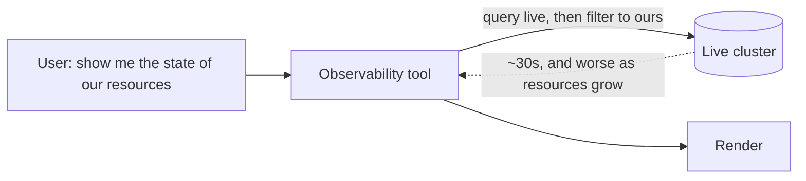
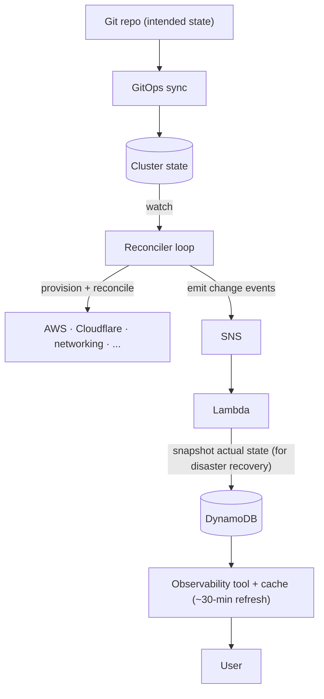
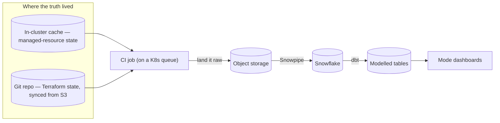
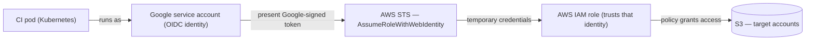
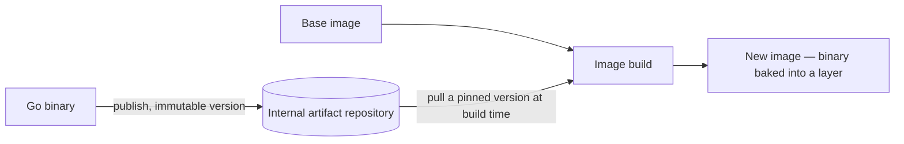

> Another true story, and a sequel to the last one. This is the story of how I got to Canva and some high level explanation of the systems I worked on. How I got here did not happen the way it might look from the outside.

My last post ended on a promise — that how I came to be at Canva was "a story for another post." This is that post.

Here is the part that still makes me smile when I say it out loud: I did not get in through the front door. In the most literal sense, I was rejected by the company I now call home. The tidy version, where someone is offered a graduate role and simply walks in, is not the one that happened to me — mine took a detour through a "no", a stint in a different industry, and a phone call from a number I almost did not answer.

## I had been here before

Before any of that, I interned at Canva. I had applied while I was in the middle of another internship at a large tech company, sat an interview — a graph problem about dependency cycles, the kind of thing you forget the details of and remember the feeling of — and somehow ended up on the inside for a summer.

The team's job was to **provision and reconcile infrastructure**: to take some intended state of the world and make the real state match it, continuously, for a large set of cloud resources. My corner of it was an **observability tool** — a way for people to look at all the resources we managed and see, at a glance, what state they were actually in.

There was also a quieter, more human layer to that summer, and it mattered more than any of the code. I had a coach who was a relentless advocate for one idea: that being the most junior person in the room was not a reason to stay quiet. He pushed me to speak up, and I leaned into the only strategy I have ever really trusted — ask for feedback constantly, and then action it faster than expected. I think that habit, more than anything technical, is what made him write the kind of feedback for me that I am still grateful for to this day.

## A tool that took thirty seconds

The work itself was simple enough to describe: we managed a large set of cloud resources, and the tool had one job: to answer, on demand, a fairly basic question — for everything we owned, what state was it actually in? The first version answered that question in the most direct way it could. When someone opened the tool, it went straight to the live cluster, pulled back what was there, and then filtered the results down to the resources our team was responsible for:

That worked, but it was slow — around thirty seconds to load — and the trend was heading the wrong way, because the more resources we took on, the longer it took. Going to the source of truth on every single page load is the sort of thing that holds up fine until it suddenly does not, and we were getting close to that point.

The fix did not come from making that query faster. It came from noticing that the answer already existed somewhere else. Quite separately, for **disaster-recovery** reasons, there was a pipeline that already captured the state of every resource. A [GitOps](https://argo-cd.readthedocs.io/) flow synced intended state into the cluster; a [reconciler loop](https://kubernetes.io/docs/concepts/architecture/controller/) watched that state and did the real work of provisioning and reconciling the underlying resources — things in AWS, Cloudflare, a networking layer I genuinely still could not fully explain to you today — and emitted change events out through a queue, into a function, and finally into a durable store:

I want to be precise about credit, the same way I was last time: most of that diagram already existed and was not my work. The piece I built was the right-hand end — from the durable store to the user. Instead of interrogating the live cluster, the tool read from that already-captured snapshot, and **cached** the result so we were not hammering the store with large reads for data that barely moved.

And that is the part I find quietly satisfying, because it is the exact inverse of the lesson from my [last post]({{ "/writing/2026/06/cached-aside-for-the-better/" | relative_url }}). There, a cache was dangerous: in a safety system, stale data could mean letting through something you should have caught, and staleness was the thing that kept me up at night. Here, the data was slow-moving by nature and nobody needed it to the second — so a cache that refreshed every thirty minutes was not a risk, it was simply the right tool for the freshness the problem actually required. The lesson, I think, is that there is no general answer to "cache or do not cache" — it depends entirely on which problem you happen to be holding at the time.

The tool itself no longer serves traffic — the [Backstage](https://backstage.io/) fork it lived in was retired during a later migration — but the ideas it proved helped kick off other initiatives across our PaaS, which is often the most a first version can hope for.

## The word this time was "restructuring"

At the end of the internship, the return offer did not come.

This was the part that was genuinely hard, because there was nothing obvious to fix. The feedback had been good, and by every account I was given I had done the things you are supposed to do. What happened was simply bigger than me. Canva was going through a restructure and pulling back hard on graduate hiring, and the reason we were given — fairly or not — was AI: the story was that the industry now wanted experienced engineers who could already use these tools well, rather than juniors to grow into them. Out of an intern cohort of around ninety, somewhere close to eight were kept on, and I was not one of them.

I am not going to dress it up, because doing everything right and still falling short is heartbreaking. I tried to go back to the other large company I had interned at, and that did not work out either, so I slowly started to make my peace with a different kind of life. I joined a large consultancy, told myself I would become a tech consultant, and quietly accepted that I might not be a software engineer anymore. There is a strange sort of calm in genuinely accepting an outcome like that — I was not bitter about any of it, I had simply stopped expecting the door to reopen.

There is an irony in all of this that I could not have appreciated at the time. The thing that was blamed for closing the door — AI — is now the thing I work with every single day. But I am getting ahead of myself.

## The number I almost did not answer

I was on a client site, in the middle of a meeting, when my phone rang with a number I did not recognise. I do not normally answer numbers I do not know, but for some reason I chose to answer the call. It was talent recruitment from Canva, and they told me a one-off role had opened up and asked me if I would be open to coming back.

Obviously, I said yes with no questions asked — I did not know which team it was, or what the role actually involved, and in that moment none of that felt important. In fact, I was far past playing it cool that I told a few colleagues a week later that I would potentially be leaving before I had anything in writing, which, in hindsight, was very reckless, though the time to reflect on my impulsiveness was short lived as the offer was shortly confirmed later.

## The first thing they handed me

The context of my first project was that there were several systems producing data about how teams across the company managed their infrastructure, and we wanted to understand one thing — were people actually adopting our **in-house way of provisioning and reconciling resources**, or were they still reaching for [Terraform](https://www.terraform.io/)?

The shape of the pipeline was a standard one. Pull from the sources and land the data **raw** — the [ELT](https://en.wikipedia.org/wiki/Extract,_load,_transform) instinct, sometimes called the "sushi principle": keep it raw, cook it later — then stream it in with [Snowpipe](https://docs.snowflake.com/en/user-guide/data-load-snowpipe-intro), model it in [Snowflake](https://www.snowflake.com/) using [dbt](https://www.getdbt.com/), and surface the result through a [Mode](https://mode.com/) dashboard:

The hard part was never the pipeline itself; it was working out where the truth actually lived. There was no single endpoint I could call that would tell me how every team across the company managed every resource. I had to piece it together from two different places: an in-cluster cache that held the live state of everything we managed on one side, and a Git repository that continuously ingested Terraform's remote state on the other. Stitched together, the metadata could finally answer the questions that mattered: which applications leaned on our platform, which leaned on Terraform, who ran a mix of both, and where adoption was really heading.

For a brand-new engineer, "go and find where the truth lives" is the best possible assignment, because it is mostly an exercise in exploring the unknown, and I will admit plainly that AI helped me do that faster than I could have alone.

One detail from this project is worth keeping, because it took me a while to truly understand it: **[federated identity](https://en.wikipedia.org/wiki/Federated_identity)**. My ingestion ran in a CI job on a Kubernetes queue, and it needed to write to S3 — but a Kubernetes pod is not an identity AWS recognises. It *was*, however, a Google identity. So the trick is to make AWS trust Google:

The pod runs as a Google service account, which can mint a short-lived, Google-signed [OIDC](https://openid.net/developers/how-connect-works/) token. AWS is configured to trust that issuer, and an IAM role's trust policy says "this Google identity may assume me." The pod presents its token to [AWS STS](https://docs.aws.amazon.com/STS/latest/APIReference/API_AssumeRoleWithWebIdentity.html), gets back temporary AWS credentials for that role, and the role's permission policy grants the actual S3 access. No long-lived keys, no shared secrets — just one cloud vouching for an identity from another. I delivered the project in about three months, and the thing I walked away with was not really the dashboard so much as a much better feel for how the whole platform provisions and reconciles the world, and for how identity flows across the seams between systems.

## Learning to lean on AI without disappearing into it

These days I write code every day with the help of AI, and I review code with it just as often, so I have had to think honestly about how to do that without quietly outsourcing my own understanding. The conclusion I keep arriving at starts somewhere slightly unexpected.

Coding, for a long time, was how I *managed* cognitive load. Software engineering was never really about typing out code; the genuinely hard part was always understanding the problem, designing a solution, and getting a room full of people to agree on it. Once writing code became second nature, it became the part you could almost switch off into — the place you went to put your head down and grind out long hours, precisely because it did not demand the heavier kind of thinking.

That low-effort layer is exactly the part AI is now extraordinarily good at taking off your hands, which means the centre of gravity of the job has shifted toward the part it *cannot* do: designing systems that are robust, reasoning about trade-offs that are specific to one business, and noticing the things a model simply has no way to know. Even now, surrounded by tools that will write whatever I ask, the moments that actually decide whether a project succeeds are conversations — with people who are more knowledgeable than I am, who see second-order consequences I would not have considered on my own.

That is genuinely why I am grateful to be where I am. I have been lucky enough to work at some very good companies, so I do not say this lightly: the people on my team are among the smartest I have ever worked with. Being the least experienced person in a room like that is not something to shrink from; if anything, it is the entire opportunity.

But it raises a real question: how do you grow, fast, as a junior engineer in an era where the machine can hand you a plausible answer to almost anything? You need a way to actually absorb knowledge rather than just route around the gaps. For some people that is reading. I have never been much of a reader, and I am not going to pretend otherwise. What I am good at is **reflection**. Concepts stick for me when I write them down, read back my own reasoning, and watch my understanding take a shape I can recognise.

So the discipline I am settling into has three parts. First, I plan strictly, and refuse to start until I actually understand the concepts the plan rests on. Then I build the thing. And then comes the part that is easiest to skip and, I think, matters most: rather than moving straight on to the next task, I sit with what I built and work out *why* it actually worked. That last step is the entire reason this blog exists. It is less a portfolio than a piece of proof, mostly for myself, that I am not just a passenger and not merely *busy*, but genuinely growing. I am not the smartest person in any room I walk into, but I am, fairly reliably, the one most willing to learn out loud.

## What I am working on now

Currently, I am working on our brand-new configuration system, which tackles the load-bearing problem of how configuration gets authored, validated, and safely delivered to a lot of services.

Besides picking up a little exposure to [Envoy](https://www.envoyproxy.io/), [Envoy Gateway](https://gateway.envoyproxy.io/), [Istio](https://istio.io/), and the [xDS protocol](https://www.envoyproxy.io/docs/envoy/latest/api-docs/xds_protocol), a small yet fun learning experience was figuring out how to reliably call a binary cross-repo. I published the binary to an internal **artifact repository** — somewhere that hands back the exact same immutable version on every request, which is what makes a build [hermetic](https://bazel.build/basics/hermeticity) and reproducible — and from there I had two options: curl the binary down each time I needed it, or bake that pinned binary into a container image at build time and run it from there. I went for the latter to cut down on the ad-hoc network calls we made every time CI spun up:

To a senior engineer, baking a binary into a container is probably routine, but as an associate it was genuinely one of the most exciting things I have done. It is these small learning experiences that make me grateful to be a young associate engineer — I am allowed to make mistakes, and there is so much still to learn. I do wonder how much that will change as I progress through my career.

## Eventually consistent

In distributed systems, *[eventual consistency](https://en.wikipedia.org/wiki/Eventual_consistency)* is the promise that even if different parts of a system temporarily disagree about the state of the world, given enough time and no new changes, they will converge on the same answer. It is also, it turns out, a fairly good description of how I got here. The system returned "no" for a while, and that answer held for long enough to feel permanent; but given enough time it reconciled, and the actual state caught up with the one that, in hindsight, it was always going to settle on.

I have come to like the term for a second reason, too. It is what I am quietly aiming at. I am surrounded by people who are further along than I am, and I do not expect to close that gap overnight. But I trust convergence. If I keep planning carefully, keep asking for feedback and actioning it faster than is comfortable — the thing my internship coach drilled into me before I had earned the right to it — and keep reflecting hard enough that the lessons actually stick, then over a long enough horizon I will become *eventually consistent* with the people around me. Not just in what I know, but in how I carry it.