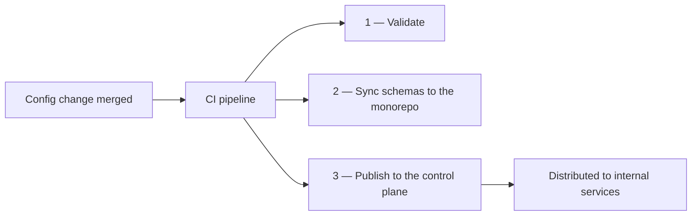

> A note before we start: this is deliberately the least technical post I have written. My first two entries were, if I am honest, written for me — a way of proving to myself that I understood the systems I had been thrown into. This one is written for the people who actually read this blog (my audience is not large, but thank you, Mum, and thank you, sis, for reading every post). Most of you do not build software for a living, so I will keep the machinery to a minimum. If you do build software for a living — hello, welcome, it is lovely to have you. The usual rules apply: this is a true story, and anything internal stays deliberately abstracted.

It has been two months since [my last post]({{ "/writing/2026/06/eventually-consistent/" | relative_url }}), which makes it five months since I joined Canva. Those first posts came out of a period when I was still finding my footing, and writing technically was how I solidified what I was learning. Lately I have noticed that the solidifying happens constantly, during work hours, as part of the job itself — so I want to use this space differently this time. I want to write about what it is actually like to be a junior engineer right now, in the middle of the AI era, because I have been having a lot of in-person conversations about it and I have not written any of it down.

## Zero to a hundred

Most software does not need to be rewritten to change how it behaves. A surprising amount of what a product does — which features are switched on, what limits apply, how systems find and talk to each other — is controlled by **configuration**: files of settings that running services read and obey. Change the file, change the behaviour. No new code required.

Which is exactly what makes delivering those files scary. The system Canva has relied on for years is mature and battle-tested, but it has what I would call a zero-to-a-hundred personality: the moment a change is deployed, it is everywhere, instantly. There is no gentle way to try a change on a small slice of the world first and let confidence build before it reaches everything — and when configuration dictates how your systems behave, instant-everywhere is a lot of trust to place in one merge. The system also leans heavily on [git](https://git-scm.com/) — the tool engineers use to track changes to files — and at the scale our main repository has reached, some of the git operations it depends on are being pushed past what they were designed for. Nothing dramatic; just enough to prompt the question of what comes next.

So my team is building the successor — a way of delivering configuration to every internal service gradually and with confidence, taking inspiration from systems like Meta's [Configerator](https://research.facebook.com/publications/holistic-configuration-management-at-facebook/). We recently reached an MVP, and my slice of it was the pipeline in the middle: the machinery that takes a merged configuration change and does three things with it.

In plain language: every merged change is checked (validation — the formatting that keeps files tidy happens locally, before a change ever lands), the *schemas* — contracts describing what a valid configuration file looks like — are mirrored across to the repository where our services live, and the finished files are published to the control plane, which handles distributing them. (The control plane is the same one my binary from the last post publishes to; it is nice when the story continues.) I also side-tracked into how we guarantee the control plane always serves the *latest* version of each file even when publishes arrive out of order — a genuinely satisfying rabbit hole that I will spare you, but the TLDR is to use a [fencing token](https://martin.kleppmann.com/2016/02/08/how-to-do-distributed-locking.html).

The first and third parts were well scoped, well agreed, and went quickly — quickly enough that I remember being surprised at how little deep thinking an MVP sometimes asks of you. The learning there was quieter: I spent an afternoon, for instance, understanding how our CI machines keep frequently used tools warm in a shared cache so that pipelines do not download everything fresh on every run. That sounds like trivia, and in the moment it mostly was — but it quietly paid for itself in decision after decision later, and it meant that when someone asked *why* something was fast or slow, I could actually explain it. However, understanding how the CI machines were managed and deployed for each CI run turned out to be a very small part of the fundamentals I learnt. And although it was satisfying, the learning was relatively well-scoped and kept cognitive load lighter than what I would subsequently experience. In hindsight, that learning alone did not drive home a key message: fundamentals compound. Remember that; it is the thesis of this post, and it took me seven failed designs to gain a deep appreciation for it. Because the second part — the sync — is where everything went sideways.

## The simple part took the longest

Here is the problem, stated the way I would state it to my mum. Two filing cabinets, in two different buildings. Whenever someone changes certain files in the first cabinet, an identical copy of those changes must appear in the second — new files added, edited files updated, deleted files removed — along with a note asking someone to double-check the copy before it becomes official.

If you are technical, you are already thinking: that is a solved problem — ask git what changed, walk the list, copy or delete accordingly, open a pull request. You are right. It is roughly a few hundred lines of code. It took me the better part of a month, and I produced seven over-engineered designs before landing on the simple one.

I want to explain how that happened, because the *how* turned out to be the most valuable thing I have learned in five months.

## An arc reactor to charge a phone

Early on, someone on the team spotted that a tool for this already existed inside our repositories: [Copybara](https://github.com/google/copybara), an open-source tool Google built to move code between repositories. "Can we investigate Copybara? It seems to do what we want" — a perfectly reasonable suggestion, and I did not question it, because I did not yet know enough to question it.

Copybara is a genuinely remarkable machine. Google uses it to keep their enormous internal repository and their public open-source projects in sync — changes flow in both directions, and files are *transformed* in flight so that each side sees the shape it expects. For this particular case, it is like Iron Man's arc reactor, and all I needed it to do was charge my phone.

The mismatch revealed itself slowly, which is the dangerous way. Copybara describes what to sync in glob patterns — "files that look like this" — and has no natural way of answering "only the files that *this particular change* touched." One of its modes wanted to rebuild the entire destination's state on every run; the mode that avoided that gave up other things we needed. So we worked around it. Then the workaround needed a workaround. At my lowest point I was seriously investigating [git fast-import](https://git-scm.com/docs/git-fast-import) — a tool built for migrating *entire repository histories* — to push a handful of copied files. Seven designs, each one patching the previous one's leak, each one further from the question we should have asked on day one.

I built those seven designs with AI, and I read every line it produced (there is *a lot* to learn from reading AI generated code). The model I pair with is *very* thorough: every conceivable race condition earned a guard clause, and every guard clause was individually defensible — that is precisely what made it educational. By constantly trying to figure out why the model did something, I would eventually understand and own that reasoning for each line, which helped me and colleagues have better discussions. Yet, I still felt the whole solution slipping away from me; each time I read yet another perfectly reasonable safeguard for copying files from one folder to another, the only honest response left was: *how did we get here?*

That question is the whole story. Asking it out loud is what finally surfaced the better one: *do we actually need Copybara at all?* And the answer was no. Our main branch is tightly controlled — every change lands as a single, squashed commit — which means "what did this change touch?" is a question git answers directly: the difference between that commit and its parent. The eighth design read that list, copied the updated files, deleted the removed ones, and opened the pull request. A few hundred lines. It was reviewed and approved within days.

The arc reactor went back on the shelf, where it belongs.

## Over-engineering used to be expensive

Here is the part I keep turning over, and the reason I am not embarrassed to publish a story about producing seven bad designs.

Before AI, over-engineering was expensive. Each of those designs would have cost me days or weeks to hand-write. Realistically I would have stopped after the second — out of exhaustion, not insight — and I would have called the stopping "judgement." Instead, I ran seven spikes (engineering slang for a quick prototype built to answer a question) in the margins of a few weeks, read everything, and got to *feel* each design fail. AI collapsed the price of my mistakes, and in doing so it let me afford an education that used to take years of expensive lessons to acquire.

I tested this framing on a staff engineer — someone very senior — at an infrastructure gathering recently. I told him the thing that nagged at me: a more experienced engineer would have seen the simple answer immediately, so what does that say about my month? His reaction, and my own reflection since, landed on the same point: seniors see the simple path quickly because *they have already built the complicated ones*. They know what complicated looks like because they have done it — slowly, expensively, over years, back when every over-engineered detour cost weeks of hand-written code. The instinct I admire in them is not magic — it is scar tissue.

What AI gave me is the same scar tissue at a fraction of the price. Calling those seven spikes "wasted work" is exactly wrong. They are why I can now read a wall of individually defensible code and feel — not just argue, *feel* — that the whole is wrong. They are why "how did we get here?" is now a question I ask early instead of never.

There were byproducts, too, the way there always are when you dig. All those guard clauses ran raw git commands, so I came out of the rabbit hole understanding git properly for the first time — what a commit actually *is* under the hood, how the staging index works, what really happens when you fetch and push (the [Git internals chapter](https://git-scm.com/book/en/v2/Git-Internals-Git-Objects)). And I learned perhaps one percent of what Copybara can do — exactly enough to respect it, and to know it was the wrong size for my problem.

## One step further back

I want to end somewhere unexpected: university mathematics.

Back then I had an obsession with truly *understanding* maths, and a quiet frustration with the people around me who seemed to simply get it — who could read a dense Wikipedia page once and walk away owning the concept. It took me years to see what was actually happening: they had fundamentals I did not. And the honest reason I never closed those gaps is that I was ashamed to ask about them. The pieces I was missing were high-school things — basic algebra, complex numbers — and there is no comfortable way, in a university lecture, to raise your hand and ask about material everyone else finished at sixteen. So the gaps stayed, and everything built on top of them wobbled.

AI has removed that shame entirely, and I do not think people talk about this enough. When I hit a concept I do not understand, I can now go one step further back — and another step, and another — until I find ground solid enough to stand on, and then climb. Nobody is watching. No question is too basic. The tuition is free and the office hours are infinite.

I know it works because I catch myself doing it for fun now. Just a week ago, there was an internal talk about why our builds got dramatically faster after upgrading our build tool, [Bazel](https://bazel.build/), and I spent five or six happy hours afterwards understanding precisely how it decides which work it can skip — it fingerprints every input and reuses results when nothing has changed, though the machinery underneath is incredibly deep (*a lot* of hashing: serialised proto wire formats, [Merkle trees](https://en.wikipedia.org/wiki/Merkle_tree) — an approach [reworked in Bazel 9](https://github.com/bazelbuild/bazel/releases/tag/9.0.0) — and caches for other hashes, like file digests). Nobody asked me to do that. It was not required for my job that week. That is rather the point: the fundamentals I was once too ashamed to backfill are now the part of the job I enjoy most.

I am not the smartest person in any room at Canva — I promise you that the rooms are terrifying. But I am no longer afraid to say *I do not know*, because I am now certain of what follows it: I know exactly how I will go and find out.

## Gradual rollout

The feature my team is building — replacing zero-to-a-hundred with something gradual, staged, and confidence-inspiring — has quietly become the way I think about this stage of my career.

I am an associate engineer, and I am aware of what that affords me: an enormous amount of learning without the full weight of delivery resting on my shoulders. I know this window does not stay open forever. Expectations will grow, the safety nets will thin, and the seven-spike detours will need to become two-spike detours. But while the window is open I intend to use every bit of it — to make the affordable mistakes, to backfill the fundamentals, to keep asking the questions I was once ashamed of.

Two months ago I wrote that I hoped to become *eventually consistent* with the people around me. I still do. What this month taught me is that convergence does not happen as one big deploy. It rolls out gradually — a stage at a time, checked at every step, with the occasional rollback along the way. Seven of them, in one memorable case.

Thank you for reading — family, and whoever else found their way here.