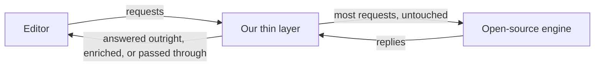

I recently had the honour of improving the developer experience for the language we use to author configuration files at Canva — a configuration-as-code (CaC) language that is small, deliberately limited, and Python-like in flavour. Over about two weeks I delivered three new features to its language server, and it was the most technically challenging project I have taken on so far. It is still a niche domain I am trying to fully wrap my head around, but I am pleased with the end result, and with the positive feedback we have received since presenting the features to the broader infrastructure team. This post is my attempt to solidify what I learned, and, at the end, to reflect honestly on how I used AI to get there.

## A language small on purpose

Some context first. Much of the configuration at Canva is written as code. The language we author it in was chosen because it is *just* powerful enough — loops, conditionals, ternaries, the tools you need to avoid repeating yourself — without being powerful enough to write a full program, because configuration is far simpler than a program and should stay that way.

A **language server** is the thing behind the editor features programmers take for granted: the dropdown that appears when you type a dot, the jump to wherever a name was defined, the documentation that pops up when you hover. Ours builds on an open-source engine that does most of the heavy lifting, and it had recently gained type information, which improved life a little. But three things were missing that I felt stood between us and a genuinely good editing experience:

1. **Completion after a dot** — "what can I put here?"
2. **Go-to-definition on dotted expressions** — "where does this field actually come from?"
3. **Better hover documentation**, especially on those same dotted expressions.

## What was missing, concretely

For (1), suppose I have:

```python
config = Config(
    widget_count = 1,
    label = "two",
)

config.|   # where "|" is my cursor
```

I would expect a dropdown listing `widget_count` and `label`. We had no dropdown.

For (2), suppose `Config` lives in another file:

```python
from some.distant.module import Config

config = Config(widget_count = 1, label = "two")
config.widget_count|   # cursor on widget_count
```

Go-to-definition should land on the `widget_count` field where `Config` is *defined*, in that other file — not bounce back to the `config` variable on the line above. That hop is exactly what our server could not do.

For (3), hover only ever showed a docstring, and only when someone had written one — which, across helper modules, was rarely. Hovering `config`, or a field on it, showed nothing. That is bearable in a five-line file; it is not in the files people actually work in, which look more like:

```python
from some.distant.module import helpers   # a bundle of helper functions

helpers.some_obscure_function(
    some_obscure_argument = helpers.another_obscure_helper("foo"),
    retry_budget = "bar",
    escalation_policy = helpers.some_other_helper("env"),
)
```

Without completion, go-to-definition, or documentation, a file like that leaves you navigating in the dark — every name a guess, every argument a tab-switch away. So I ran a spike in my own time, demonstrated a proof of concept to the team, and everyone agreed these should be first-class features. Productionising them became my job.

## Standing in the middle

Editors talk to language servers over a standard protocol, the [Language Server Protocol](https://microsoft.github.io/language-server-protocol/): the editor sends requests ("complete here", "define this", "what is this?") and notifications ("this file changed"), and the server replies. Previously, every one of those requests went straight to the open-source engine, and it handled everything.

That left three options for adding features. Contribute them upstream — the right thing in the long run, but unlikely inside a two-week window given how much code was involved. Fork the engine — which means owning a large codebase we barely understood, and inheriting merge conflicts forever. Or put something thin in the middle.

I went with the middle. A small layer now sits between the editor and the engine. For a handful of request types it takes the wheel: it answers outright (completion and go-to-definition on dotted expressions), or it lets the engine answer first and fills in only when the reply came back empty (hover). Everything else passes through untouched.



The important property is that the worst case is silence where there was already silence: the layer only answers questions the engine could not, so it is a strict superset of what we had. Inside it, I gave each piece one narrow job — one remembers what the files look like, one works out what a dotted chain refers to, one dresses the answer back up as a protocol message — which is the discipline my proof of concept had entirely lacked.

## Two ideas that carried the whole thing

**Remember the last good version.** As you type, the editor tells the server about every change — but half-typed code does not parse. `config.` on its own is a syntax error. So the layer keeps two things per file: the latest text exactly as written, and the most recent snapshot that *did* parse, along with everything it learned from it. Nearly every question is answered from that last good snapshot, which is how the features keep working while the file is temporarily broken. (The one edge: a brand-new file that has never parsed has nothing to answer from until you make it valid once.)

**Everything under the cursor is a chain.** Whatever you are pointing at, we turn it into the same shape — a root, then a series of member hops, each remembering whether it was called:

```python
config.queue          # root: config            hop: queue
make().queue          # root: make (called)     hop: queue
"a b".split()         # root: a string literal  hop: split (called)
```

All three features then ask a single question: *what does this chain refer to, here?* "Here" matters — only things defined above the cursor count. The answer is found by looking up the root in the current file, following imports into other files until a real definition appears, then walking each hop. A name that was not called is whatever it was bound to; a name that was called is whatever the call *produces*. And when we cannot tell — an unannotated function, say — we stay quiet rather than guess. Completion reads that answer for its members, go-to-definition for where they were declared, and hover for documentation or, failing that, a snippet of the defining source.

## Feature notes

**Completion** has one awkward wrinkle: `config.` is precisely the thing the last good snapshot cannot contain, because it never parsed. So this is the one place we read the live line of text instead, recover the chain from it, and only then ask the usual question. If we cannot work out what the chain is, we offer nothing — an empty list is more honest than a dump of every global in scope.

**Go-to-definition** is where the boundary between "ours" and "the engine's" is sharpest, and the boundary is the dot. Members are ours; bare names stay with the engine. That leaves one honest gap. The engine's lookup is exactly one hop deep, so a name passed through an intermediate module defeats it:

```python
# defs.py
def params(default, overrides): ...

# helpers.py
from defs import params        # passed through — helpers.py never *defines* params

# service.py
from helpers import params
params                          # go-to here stops one hop short of defs.py
```

Our layer follows imports as far as they go — but only once there is a dot involved. Write the same pass-through as a member (`helpers.params`) and go-to lands on the `def` two files away. Routing bare names through our layer would close that gap; I have deliberately not done it yet, for a reason I will come to.

**Hover** never withholds: the engine answers first, so its docstrings stay authoritative, and we fill in — a member's documentation or defining source, a summary for a builtin — only when the engine came back empty.

## Where this is naive

I want to be honest that the approach is naive, and I am curious how long we can get away with it. It rests on assumptions I have not tested at scale: that configuration files stay reasonably small, and that people write concise lines. The live-line scanning for completion re-parses a line several times per keystroke and never looks beyond the current line, so a chain that starts on the line above is simply out of reach. And every request our layer takes over is one we have to get *at least* as right as the engine, forever — which is the real reason bare names are still forwarded: today the worst case is silence where there was already silence, and taking over bare names would make the worst case a wrong answer where there used to be a right one.

These features were motivated by a feeling and shipped on the strength of a demo. That is a fine way to start and a poor way to decide what comes next. Before rebuilding any of it, I would want to know how people actually use it.

## On going slow

I usually try to embed a lesson in these posts. This time, most of the post has gone into solidifying my own understanding — hence, I suppose, the name of this blog — because this project was genuinely hard to digest, and I spent many late nights just trying to understand what was going on. Given how heavily I leaned on AI to get through it, I think I owe myself a concise reflection on that, especially this early in my career.

Terence Tao made an argument in [a recent interview](https://www.youtube.com/watch?v=svl_1upFpQo) about a paradox of AI: that it is sometimes better to be slow, because the process of getting somewhere is often more valuable than the destination — especially when the process involves other people, which is the part he says AI cannot yet replicate. Skipping it, he says, is like watching only the beginning and the end of a film: technically every plot line resolves, but most of the value was in the middle.

That is the advice I want to carry through my career in this era, and this project was a small test of it. Much of my time was spent understanding *enough* to justify why the AI did what it did as the implementation took shape. I had my own perspectives embedded throughout, but nothing that shifted the project architecturally. What I noticed is that once I understood enough, my genuine epiphanies came only when collaborating with teammates, and those conversations are what ultimately made the product better. Perhaps AI will feel more conversational eventually. For now I find it a very good tool for gaining just enough knowledge to collaborate effectively with the people around me — and the collaboration is where the good decisions came from.

Ultimately, I think AI is proving to be a net benefit to my development. But that comes with a condition I have yet to resolve with full clarity: that I keep using it in a way that helps me become the kind of professional I want to be over the next thirty years, rather than one that merely gets this fortnight's work out the door. The film is long. I would like to watch the middle.
